## Design a Singlet Lens with OpticStudio

---

### Design goal

Design a 20 mm diameter singlet lens for visible light made from Schott N-BK7 glass that operates at f number 5 (written f/5). The lens should operate with an angular field of view of up to $\pm4\degree$ from the optic axis.
 

### Initial Calculations

Before we jump into OpticStudio, let's do a few calculations.

- From the requirements of the lens described above, the focal length of the lens can be determined as follows:

  f/#$=\frac{f}{d}$

  $f = d ($f/#$) = 20 (5)= 100 mm$
 
- From the OpticStudio Glass Report function of the Materials Catalog, we can determine the refractive index of the N-BK7 glass at the optical wavelength of 588 nm, which is called the “sodium D line."

  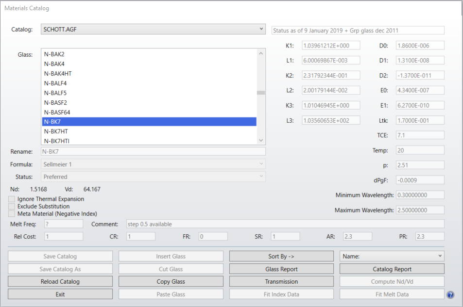

  $N_d=1.5168$
 
- We will go for a plano-convex lens to achieve the effective focal length of 100mm. Using the Lensmaker’s equation, we let $R_{1}$ be the curved side and $R_{2}$ be infinite (that is, side two is flat or “plano”). Thus we determined the radius of curvature $R_1$ for the plano-convex singlet.

  $\frac{1}{f} = (n-1)[\frac{1}{R_1}-\frac{1}{R_2}+\frac{(n-1)d}{nR_1R_2}]$
  
  $\frac{1}{100} = (1.5168-1)[\frac{1}{R_{1}}]$
  $R_{1} = 100(1.5168-1)$
  $R_{1} = 51.68$ mm
 

### Setting up the lens in OpticStudio

- A new lens file is created with the `File/New` command in OpticStudio.
  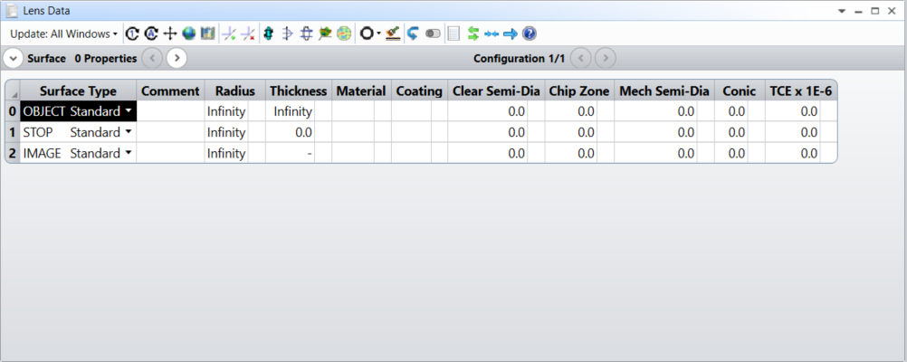
   
- The lens data editor will have three rows with surface types 0: OBJECT, 1: STOP, and 2: IMAGE. Right click on the row 1:STOP in any column except the Surf:Type to bring up a menu that begins with Copy Cell. Select Insert Surface After so that the surfaces are now 0: OBJECT, 1: STOP, 2: and 3: IMAGE.
  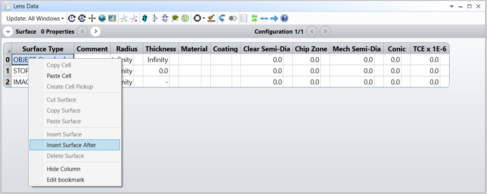
   
- On surface 1: STOP, enter the calculated radius of curvature (51.68 mm), a thickness of 5 mm, material of N-BK7 and clear semi diameter of 10 mm. Before entering the radius of curvature, the lens data editor should look like:
  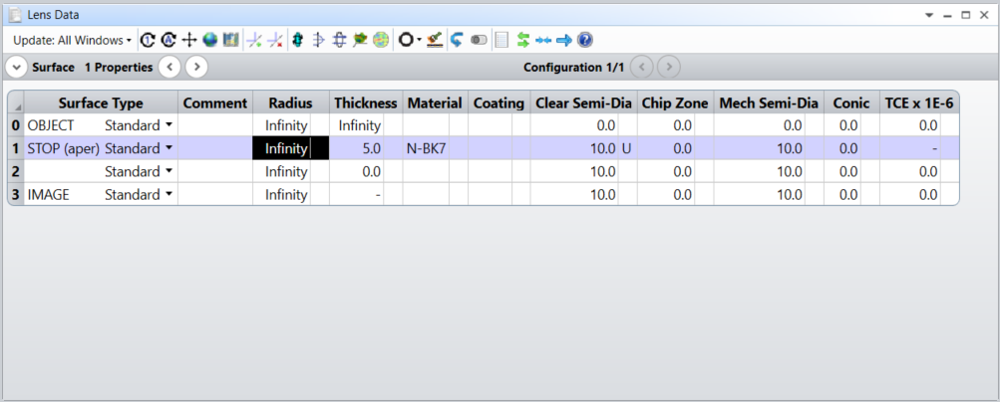
   
- Using the Setup/System Explorer, enter the aperture as Float by Stop Size and the wavelengths as (F, d, C) Visible. The System Explorer window should look like:
  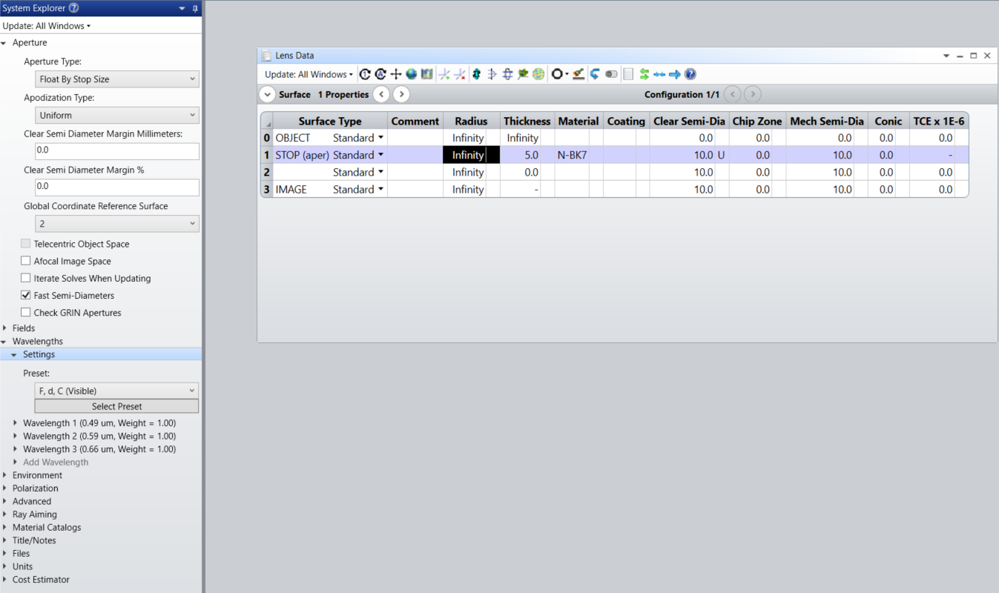
   
- After inserting the radius of 51.68, bring up a layout window with Analyze/Cross-Section.
  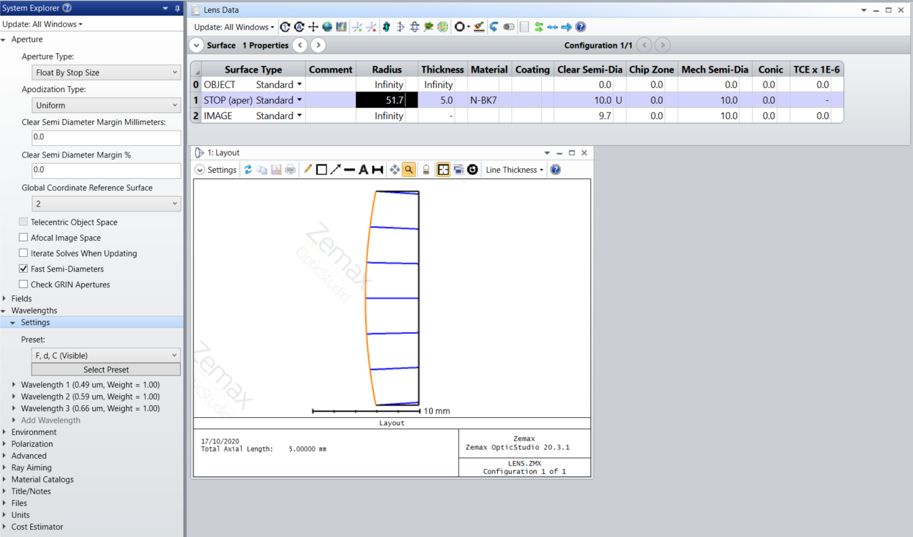
   
- On surface 2, click on the small column just to the right of thickness to bring up a menu labeled “Thickness solve on surface 2” as shown below. From the Solve Type menu, select Marginal Ray Height and hit return. This is a “solve”, i.e. a calculation done by OpticStudio to solve for a property of the lens. In this case, we are setting the thickness from the back surface of the lens (#2) to the image (#3) such that the marginal ray which just hits the outer edge of the stop is forced to have a height of zero at the next surface. In other words, the program will choose the distance from surface 2 (the back of the lens) to surface 3 such that the light comes to a focus at surface 3.

  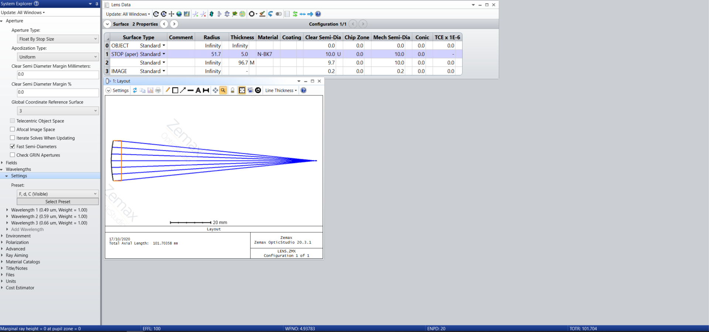

### Observations

| Parameter                        | Value    | 
| -------------                    |:---------:| 
| Effective focal length           |100 mm    | 
| Working f-number                 |4.938 mm  | 
|Total track of the system (TOTR)  |101.74 mm |
|Back focal length                 | 96.7 mm  |

- The first three quantities requested are reported at the bottom of the window.

- The working f-number is close to the design goal but differs due to the finite thickness of the lens.

- The total track of the system (TOTR) is the total length of the system. Since the object is at infinite distance, here it means from the vertex of the first lens to the image plane.

- The back focal length is the distance from the last surface vertex and the focal point (i.e. the thickness of surface 2). Note that this is slightly less than the effective focal length.
 

### Define multiple inputs to the lens using OpticStudio

- Use the System Explorer to add two more object points, specified as field angles. That is, the object at infinity is currently on the axis and thus the rays entering from the left are at an angle of 0 degrees. Add objects at 2 and 4 degrees such that the `System Explorer / Fields` menu looks like:
  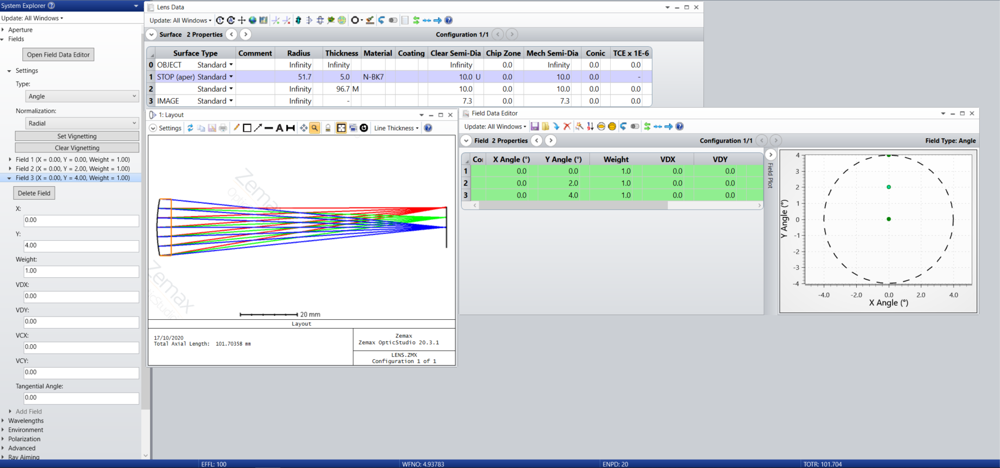
 

- By changing the Settings menu of the Layout window to reduce the number of rays to 1, this shows only the central ray of the bundle.

  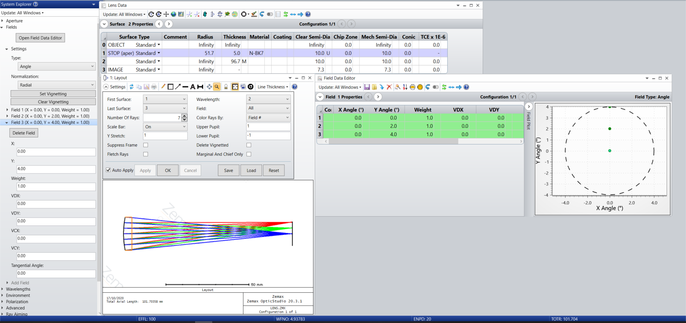
  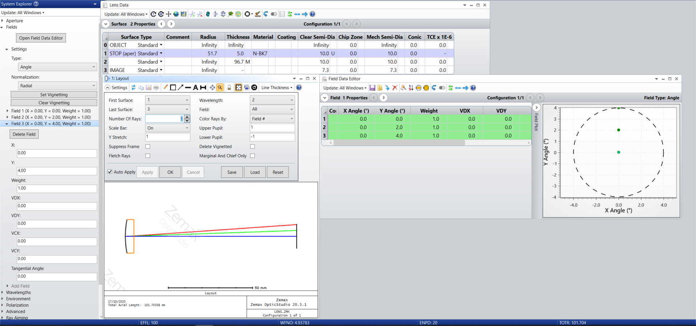
   
   
- The chief ray that strikes the middle of the lens  exits the lens with no change in angle. Since this ray continues on to the image plane, it allows us to calculate the image height as a function of the object ray angle and focal length. 

  $h = f\tan(\theta)$

   
  Using paraxial approximation where 
  
  $\sin \theta \approx \tan \theta \approx \theta$

  $h = f\theta$

   

  For the red ray where angle = $4\degree$ (i.e. 0.0698 radian)

  $h = 100 (0.0698) = 69.8 mm$

  
   

### Analyze the performance of the lens

Now we will analyze the performance of this lens by finding how tightly the rays are focused for various objects.

- Zoom the layout window by clicking and dragging around on the focal region. Use the reset zoom button (curly white arrow in a black circle) if you get lost. 
 
- We can see from this layout below that the rays are not focusing perfectly and that the imperfection, called aberration in optics, depends on the field angle.
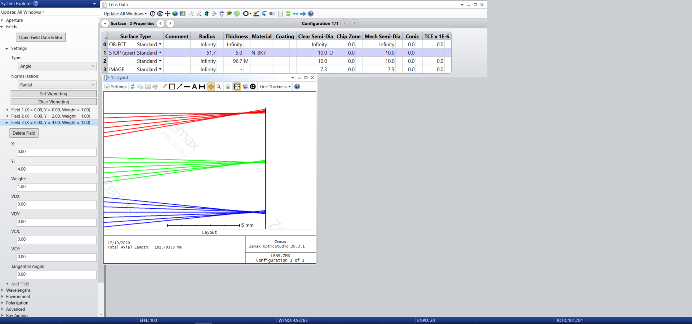
 

- To measure the size of these spots, bring up the Analyze / Rays & Spots / Standard Spot Diagram window. This shows how a bundle of rays launched from each object field angle converges at the image plane for each wavelength. Note that color in this window is used to indicate wavelength, while in the Layout window, we are currently using color to represent field angle.
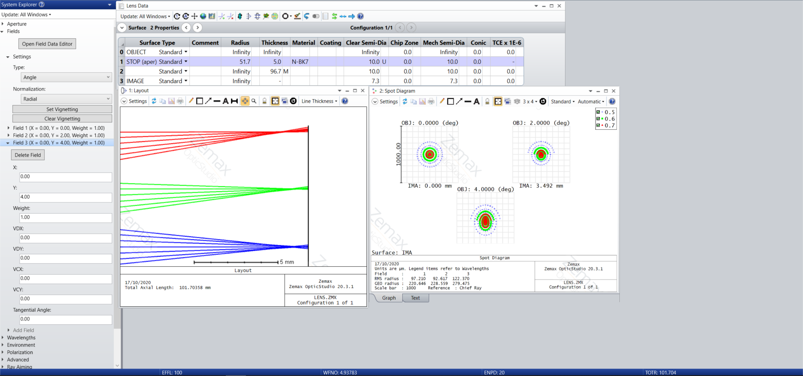
 
- Use the Settings menu of the Spot Diagram window and change Wavelength from All to 2. The second wavelength is 588 nm, or sodium D. Also check the box Show Airy Disk. The Spot Diagram window should now look like:
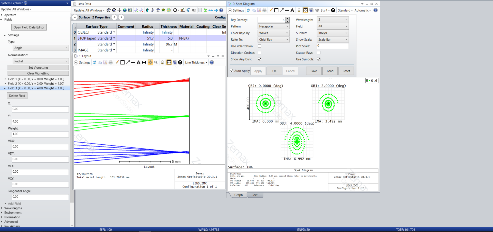
 
- There is quite a bit of information here. 
    - The IMA coordinates are the centroid locations of the image spots and should be near to the previous calculation of image height (for the 4$\degree$ field). 
    - The tiny black circles at the center of each spot show the theoretical diffraction limited performance of this lens, from which we conclude that this lens is operating far from the best possible performance. 
    - Note that the spots are not symmetrical for the off-axis field angles. 
    - Also note that not all rays from the object reach the image for the off-axis field angles – this is why the bottom of the outermost arc is missing for 2 and 4 degree field angles. This is called vignetting. 
 
- Switch to the Text version of the Spot Diagram window using the tab at the bottom and find the spot radius for each field angle, defined as the root mean square of the ray deviations from a central reference point (typically the centroid of the rays).
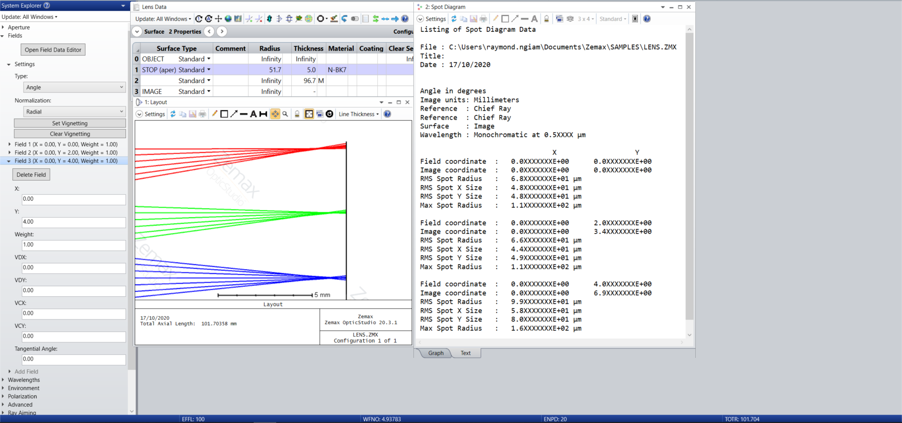