## Best Form Singlet Optimization

---

### Design Goal

In OpticStudio, create a BK7 best form singlet lens of 10 mm semi-diameter and with 10 mm thickness. Set the wavelength to the (default) 550 nm and a single on-axis field point at infinite object distance. The target image distance is 200 mm. 

### Initial Calculation

Let's start to design a symmetric, bi-convex lens with an effective focal length of 200 mm. Using the Lens maker equation, we can calculate the initial glass curvatures .

Lens maker equation:

$\frac{1}{f} = (n-1)(\frac{1}{r_1}-\frac{1}{r_2}+\frac{(n-1)d}{nr_1r_2})$

Lens maker equation for biconvex lens with same curvature, $r$:

$\frac{1}{f} = (n-1)(\frac{1}{r}-\frac{1}{-r}+\frac{(n-1)d}{n(-r^2)})$

$\frac{1}{f(n-1)} = \frac{2}{r}-\frac{(n-1)d}{nr^2}$

$\frac{1}{f(n-1)} = \frac{2nr - nd+d}{nr^2}$

$nr^2 = f(n-1)(2nr - nd+d)$

Solves for $r$ and substitute $n=1.5168$, $d=10$ ,$f=200$

Hence, $r$ = [1.718, 205.002] mm

Since $r=$ 1.718 mm is too small for lens with clear semi-diameter of 10mm, we will use r = 205.002 mm

### Initial Layout

Note that from the `Spot Diagram` tab, there is a 170 micron RMS spot radius for this initial lens design.

### Optimization

O​pen the Merit Function Editor and click the "Load Merit Function" button on the toolbar. Select the `RMS Spot Size.MF` merit function in the `Zemax/MeritFunction` directory. 

Then insert one extra line at the top of the merit function. Assign the operator to be EFFL, for effective focal length. Make the target 200 mm and the weight 1.0. 

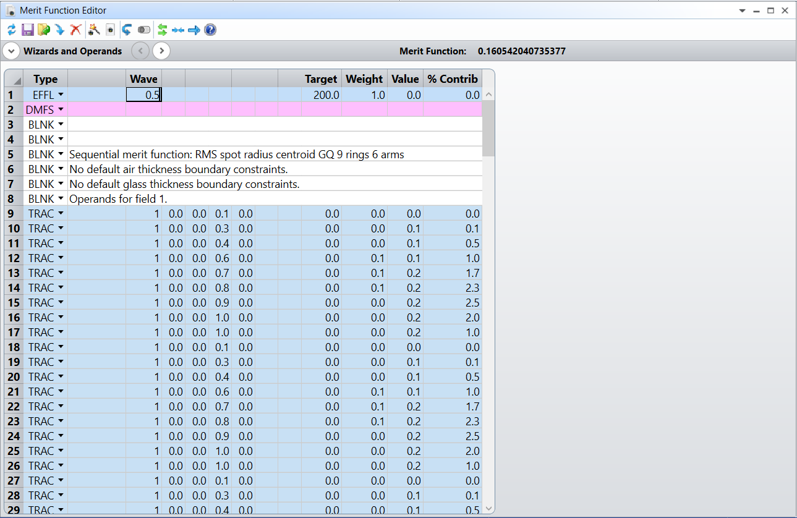

Assign both glass curvatures and the distance to the image plane to be variables (but no others). 

Now optimize using 5 cycles and hitting Start a number of times until the Current Merit Function stabilizes. This will bend the lens subject to the constraint of maintaining an EFL of 200 mm and optimally defocusing the image plane. 

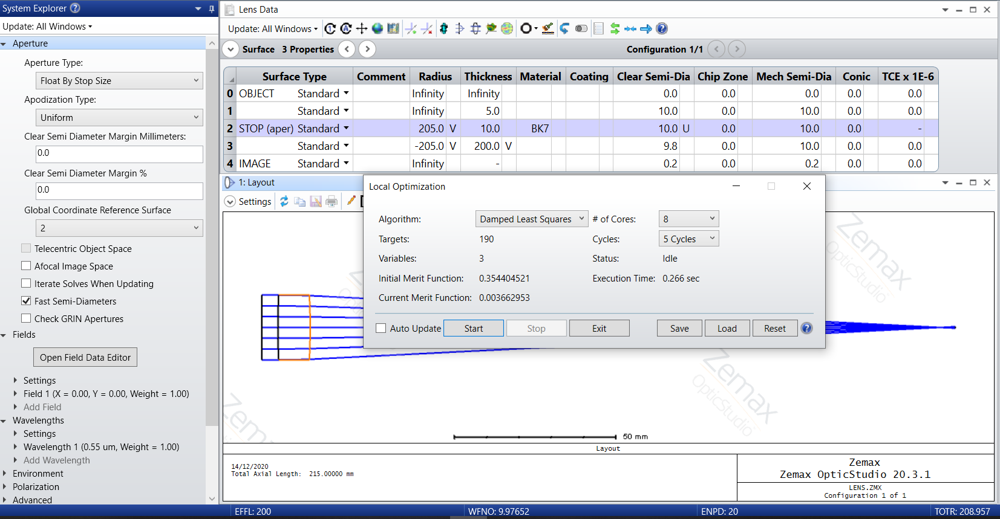

Notice that the initial error 0.5344 was minimized to 0.0036 at the end of the optimization.

Here we got a very nearly diffraction limited performance with very nearly a plano-convex lens, plano side towards the image. 

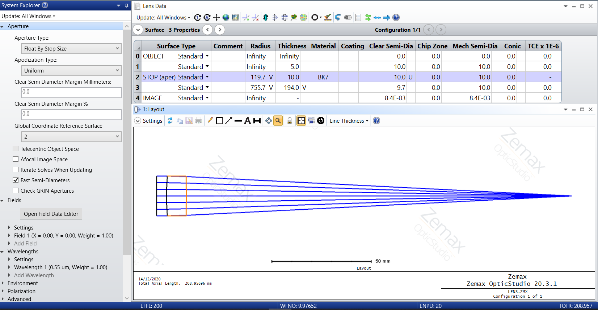

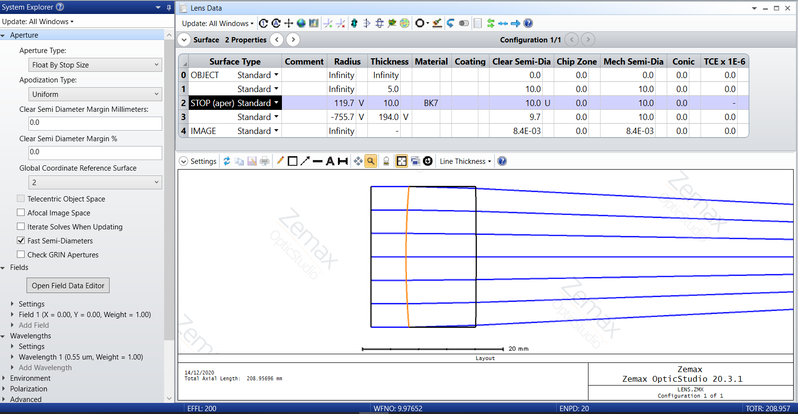

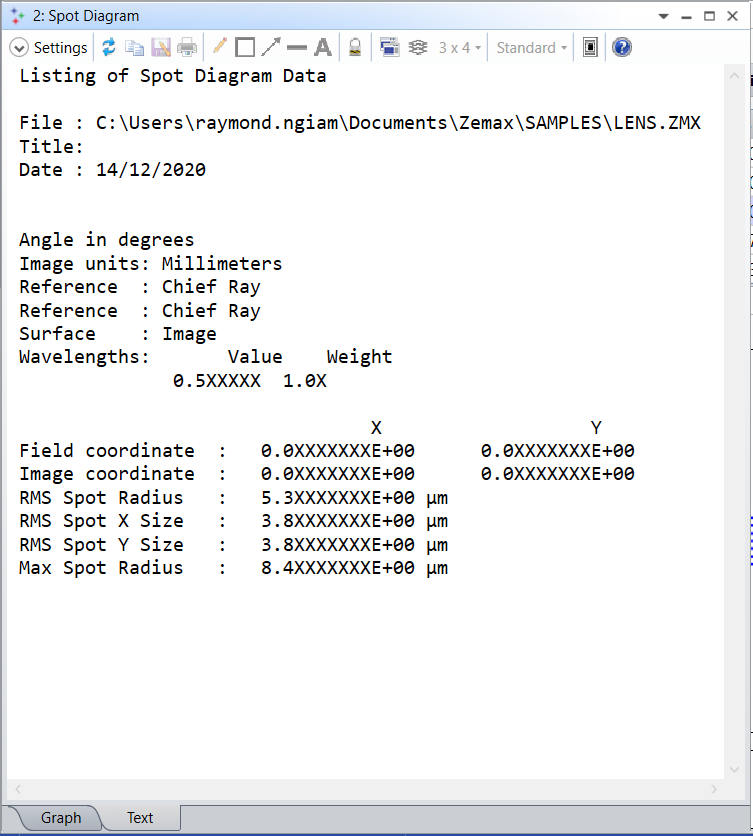

The final outcome has an RMS spot radius of 5.3 microns, which is significantly smaller than the initial 170 microns.

### Plano-convex variant

Set the nearly plano side of the lens to be plano and remove it from the optimization (that is, there are now only two optimization variables). Re-optimize this lens that is now forced to be plano-convex. 

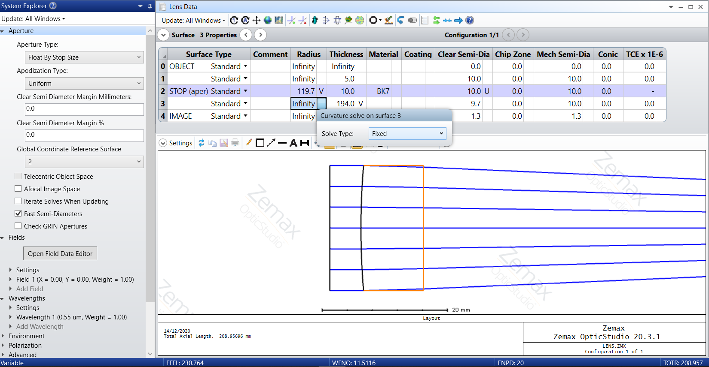

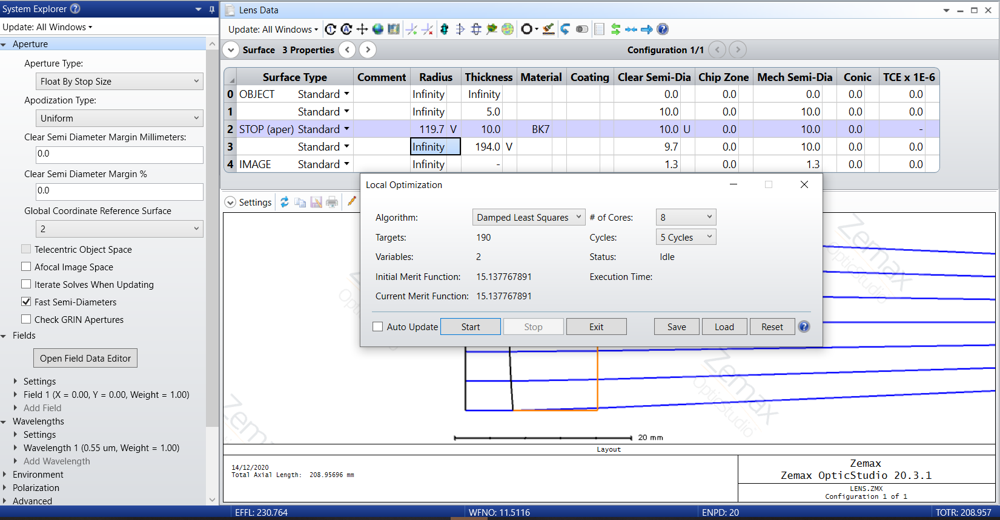

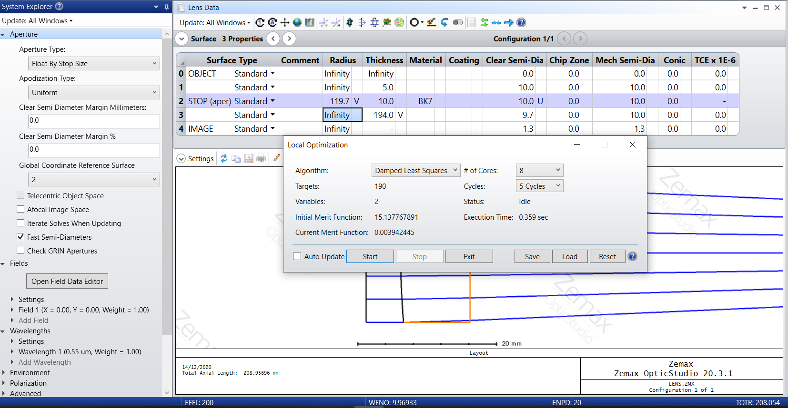

Notice that the initial error 15.1377 was minimized to 0.0039 at the end of the optimization.

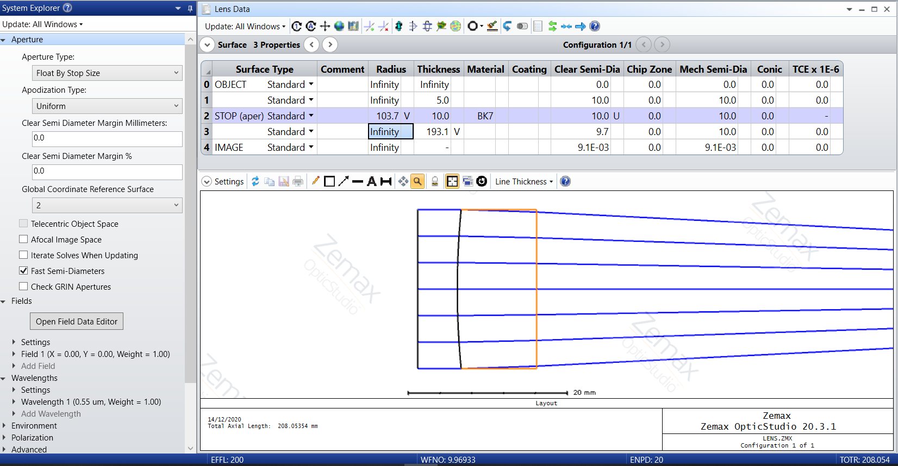

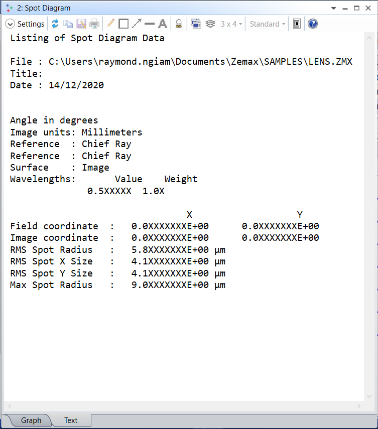

Since the optimized error is slightly greater than the previous design with 3 variables being optimized, i.e. 0.0039 vs the previous 0.0036, thus the RMS spot radius is also slightly larger, i.e. 5.8 microns vs the previous 5.3 microns.

The performance in terms of RMS spot radius is comparable between the plano-convex design and the best form bi-convex lens. 

Given the fact that plano-convex lens is easier and cheaper to fabricate (as there is one less surface curvature to control), this shows why plano-convex are useful, despite apparently only using one of the two curved surfaces.

### Orientation of best form / plano-convex lenses

Reverse the plano-convex lens, i.e. exchange the curvatures of the front and back surfaces.

Verify the layout to make sure the lens now has the plano side towards the incoming collimated beam and the curved side towards the focus. 

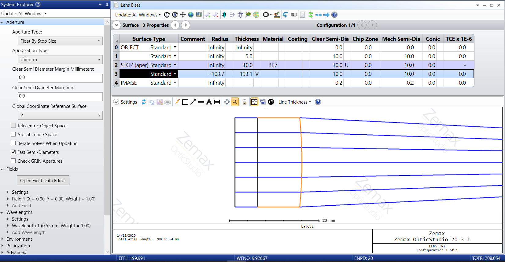

Remove the remaining curvature from the optimization, leaving only the back focal distance as a variable. 

Re-optimize to find best focus. 

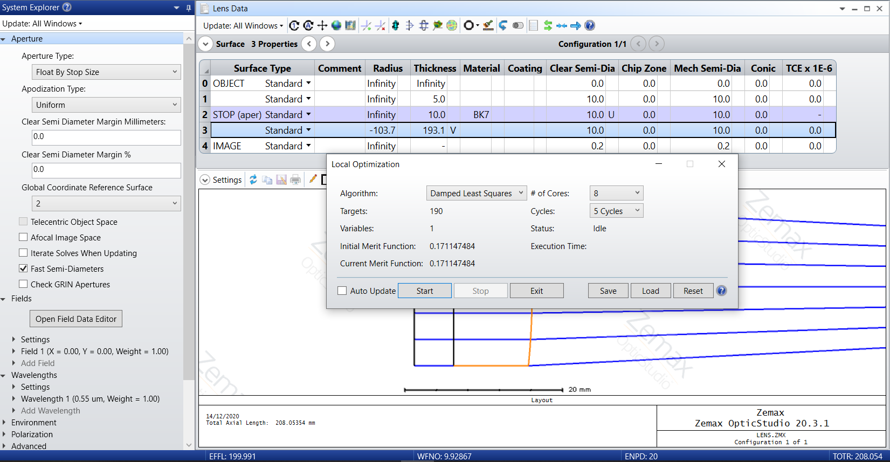

Notice that the initial error 0.1711 was minimized to 0.0162 at the end of the optimization.

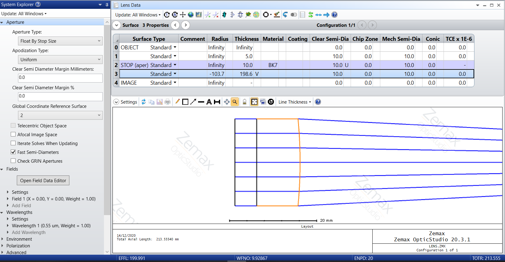

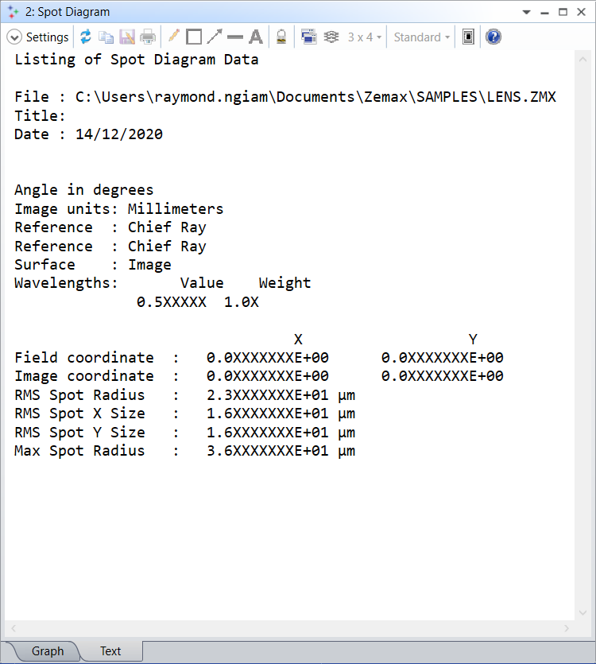

The final outcome of the reversely placed plano-convex lens has an RMS spot radius of 23 microns, which is significantly greater than when it was placed in the designed orientation, i.e. 5.8 microns.

This shows why we need to pay attention to orientation when inserting lenses in simulations or in the lab.