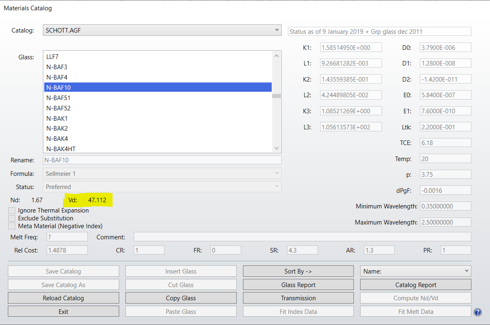
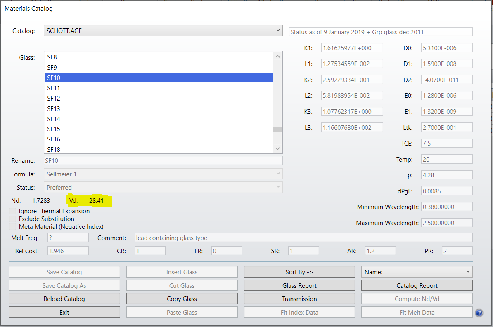
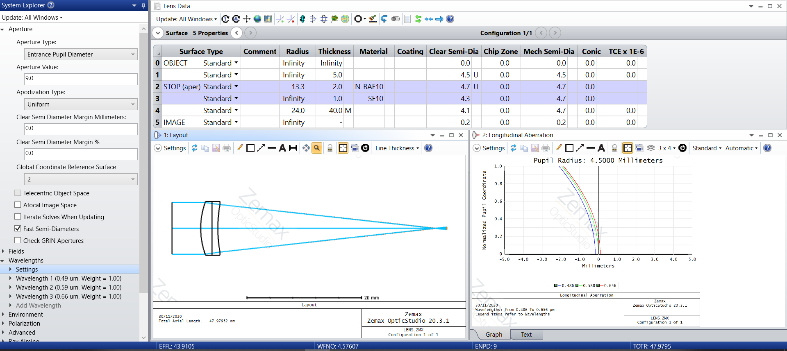
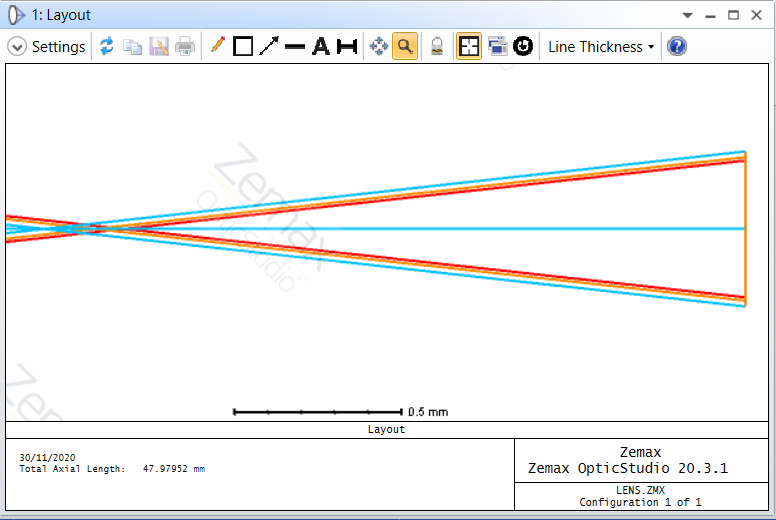
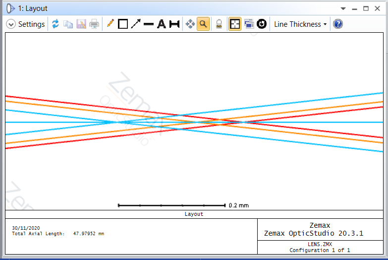
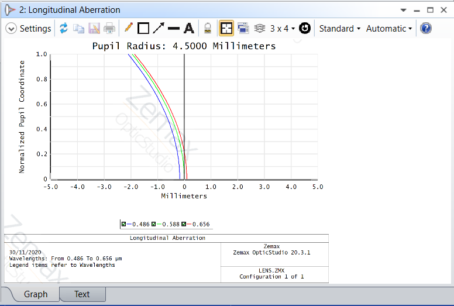
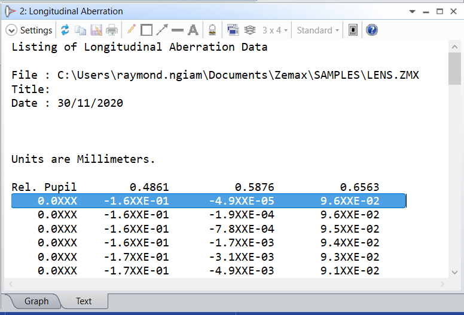

## Achromat Lens Design

---

### Design Goal

Design an achromatic doublet with a sodium D focal length of 50 mm using the N-BAF10 crown and SF10 flint glasses. Constrain the interior surface that is mutual to both singlets to have zero curvature. 

### Initial Calculation

First and foremost, we need to determine the focal lengths of the crown and flint singlets.

From the definition of Abbe V-number, $V$

$\frac{\Phi_F - \Phi_C}{\Phi_{D}} = \frac{1}{V_D}$

$\Phi_F - \Phi_C = \frac{\Phi_{D}}{V_D}$

where 
$\Phi_F$ is the power of the lens at the sodium-F line (blue)

$\Phi_C$ is the power of the lens at the sodium-C line (red)

$\Phi_D$ is the power of the lens at the sodium-d line (yellow)

$V_D$ is the Abbe V-number for the material at the sodium-d line (yellow)

Considering a doublet,

$\Phi_{D,Doublet} = \Phi_{D,1} + \Phi_{D,2}$

Individual lens, i.e. Lens 1 and Lens 2 has the following dispersion equations:

$\Phi_{F,1} - \Phi_{C,1} = \frac{\Phi_{D,1}}{V_1}$ -------- (1)

$\Phi_{F,2} - \Phi_{C,2} = \frac{\Phi_{D,2}}{V_2}$ -------- (2)

By summing up equation (1) and (2),

$(\Phi_{F,1} + \Phi_{F,2}) - (\Phi_{C,1} + \Phi_{C,2}) = \frac{\Phi_{D,1}}{V_1} + \frac{\Phi_{D,2}}{V_2}$

$\Phi_{F,Doublet} - \Phi_{C,Doublet} = \frac{\Phi_{D,1}}{V_1} + \frac{\Phi_{D,2}}{V_2}$

To design a achromatic doublet means  to set the dispersion, i.e. $\Phi_{F,Doublet} - \Phi_{C,Doublet}$ to zero, hence

$0 = \frac{\Phi_{D,1}}{V_1} + \frac{\Phi_{D,2}}{V_2}$

$\frac{\Phi_{D,1}}{V_1} =  - \frac{\Phi_{D,2}}{V_2}$

$\Phi_{D,1}=-\frac{V_1}{V_2}\Phi_{D,2}$

 
 

From the fact the lens power adds up, for sodium-d line:

$\Phi_{D}=\Phi_{D,1}+\Phi_{D,2}$
$\Phi_{D,2}=\Phi_{D}-\Phi_{D,1}$

 

$\Phi_{D,1}=-\frac{V_1}{V_2}\Phi_{D,2}$
$\Phi_{D,1}=-\frac{V_1}{V_2}(\Phi_{D}-\Phi_{D,1})$
$\Phi_{D,1}(1-\frac{V_1}{V_2})=-\frac{V_1}{V_2}\Phi_{D}$
$\Phi_{D,1}(\frac{V_2-V_1}{V_2})=-\frac{V_1}{V_2}\Phi_{D}$
$\Phi_{D,1}=\frac{V_1}{V_1-V_2}\Phi_{D}$

From OpticStudio's `Material Catalog`, we can obtain the Abbe V-number for the crown and flint glass, i.e. 47.112 and 28.41 respectively.

By plugging in the Abbe V-numbers,

$\Phi_{D,1}=\frac{V_1}{V_1-V_2}\Phi_{D}$
$\Phi_{D,1}=\frac{47.112}{47.112-28.41}(\frac{1}{50})$
$\Phi_{D,1}=0.0504 mm^{-1}$
$f_{D,1} = \frac{1}{\Phi_{D,1}}=19.85 mm$

$\Phi_{D,2}=\Phi_{D}-\Phi_{D,1}$
$\Phi_{D,2}=\frac{1}{50}-\frac{1}{19.85}$
$\Phi_{D,2}=-0.03038 mm^{-1}$
$f_{D,2} = \frac{1}{\Phi_{D,2}} = -32.91 mm$

Next, we need to determine the radius of curvature for surface 1 and surface 3 (considering interior surface, i.e. surface 2, that is mutual to both singlets is constrained to have zero curvature)

$\Phi = (n-1)(c_1-c_2+\frac{(n-1)dc_1c_2}{n})$

Given $c_2 = 0$,

$\Phi_{D,1} = (n_{D,1} - 1)(c_1)$
$0.0504 = (1.67 - 1)c_1$

$0.0504 = 0.67c_1$
$c_1 = \frac{0.0504}{0.67} = 0.0752$
$r_1 = \frac{1}{c_1} = \frac{1}{0.0752} = 13.294$ mm

 

$\Phi_{D,2} = (n_{D,2} - 1)(0 -c_3)$
$-0.03038 = (1.7283 - 1)(-c_3)$
$-0.03038 = -0.7283c_3$
$c_3 = \frac{-0.03038}{-0.7283} = 0.0417$
$r_3 = \frac{1}{c_3} = \frac{1}{0.0417} = 23.973$ mm

## OpticStudio Layout

To approximate the design condition of thin lenses, let the on-axis thickness of the crown be 2 mm and the on-axis thickness of the flint be 1 mm. 

The field point at $0\degree$ from infinity is set to have a `Clear Semi-Dia` of 4.5 mm. The lens' `Clear Semi-Dia` is set to be 4.7 mm, and the `Aperture Type` was chosen to be `Entrance Pupil Diameter` with value > 4.5 mm. 

The image plane distance is set to solve for marginal ray height equal 0. 

The `Number of Rays` setting in `Layout` was set to be 3 so that only the chief ray and 2 marginal rays were displayed.

The final lens layout is as shown below:

Zoomed-in illustration of the image plane:

The image formed by the marginal rays appears in front of the paraxial image plane. A further zoomed-in illustration is as shown below:

The cyan rays represent blue wavelength, the orange rays represent yellow wavelength, and the red rays represent the red wavelength.

## Interpreting the Longitudinal Aberration plot

The `Longitudinal Abberation` view shows the offset due to longitudinal chromatic aberration.

The title of the plot shows `Pupil Radius`, which is equal to the radius of the effective entrance pupil. Since the limiting aperture in our lens layout is the `Clear Semi-Dia` of the field point, hence the `Pupil Radius` shown here is 4.5 mm.

The `Normalized Pupil Coordinate` axis of the plot here indicates the position that the object space ray (from infinity) enters the entrance pupil. 

The value `1.0` means the ray is marginal ray that happens to be the edge of the entrance pupil (or a point at the top of the bundle of rays entering the system). 

The value `0` means the ray is equivalent to a point at the center of the ray bundle.

The change in effective focal length $F_C-F_F$​ of this achromat lens (on-axis, i.e. `Rel-Pupil`= 0) is

$F_C-F_F = 9.6 \times 10^{-2} - (-1.6 \times 10^{-1})$
$F_C-F_F = 0.096 + 0.16 = 0.256$ mm