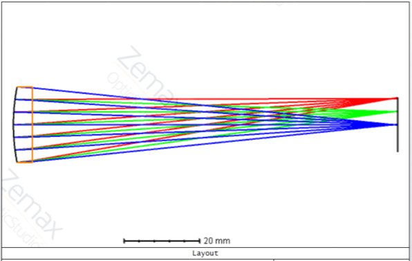
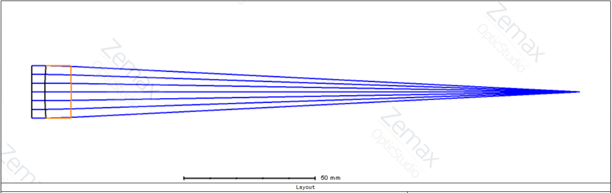
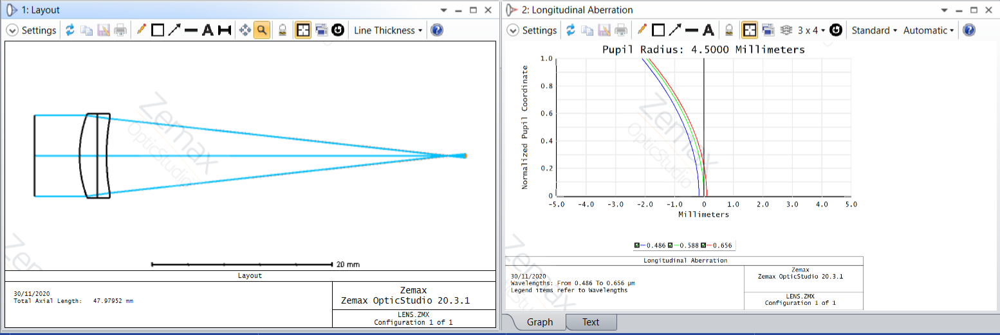

# Optical Engineering Projects

---

1. <a href='https://raymondngiam.github.io/OpticalEngineering-SingletDesign'>Design a Singlet Lens with OpticStudio</a>

    
     

2. <a href='https://raymondngiam.github.io/OpticalEngineering-BestFormSingletOptimization'>Best Form Singlet Optimization with OpticStudio</a>

    
     

3. <a href='https://raymondngiam.github.io/OpticalEngineering-AchromatDesign'>Achromatic Doublet Design with OpticStudio</a>

    
     