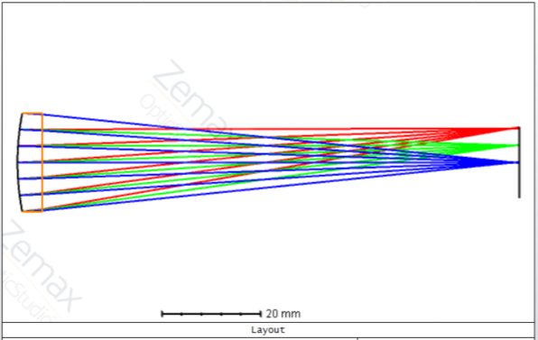
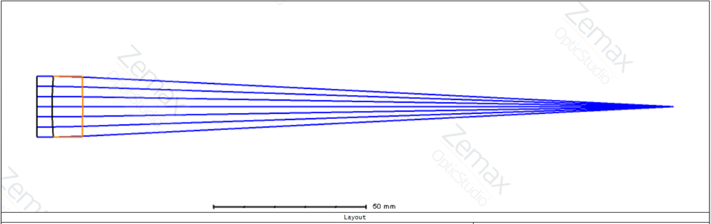
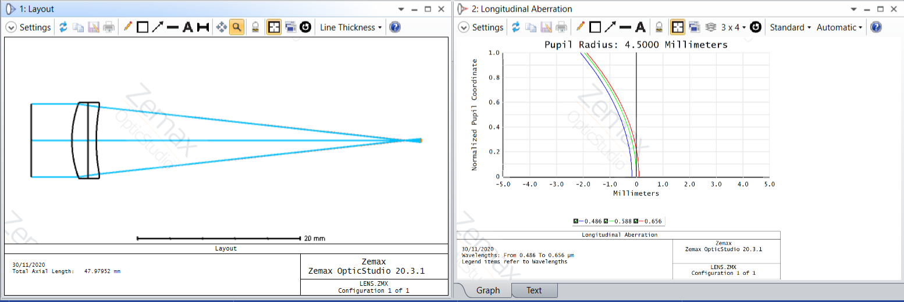

# Optical Engineering Projects

---

1. <a href='https://htmlpreview.github.io/?https://github.com/raymondngiam/OpticalEngineeringProjects/blob/master/01-SingletDesign/readme.html'>Design a Singlet Lens with OpticStudio</a>

    
     

2. <a href='https://htmlpreview.github.io/?https://github.com/raymondngiam/OpticalEngineeringProjects/blob/master/02-BestFormSingletOptimization/readme.html'>Best Form Singlet Optimization with OpticStudio</a>

    
     

3. <a href='https://htmlpreview.github.io/?https://github.com/raymondngiam/OpticalEngineeringProjects/blob/master/03-AchromatDesign/readme.html'>Achromatic Doublet Design with OpticStudio</a>

    
     